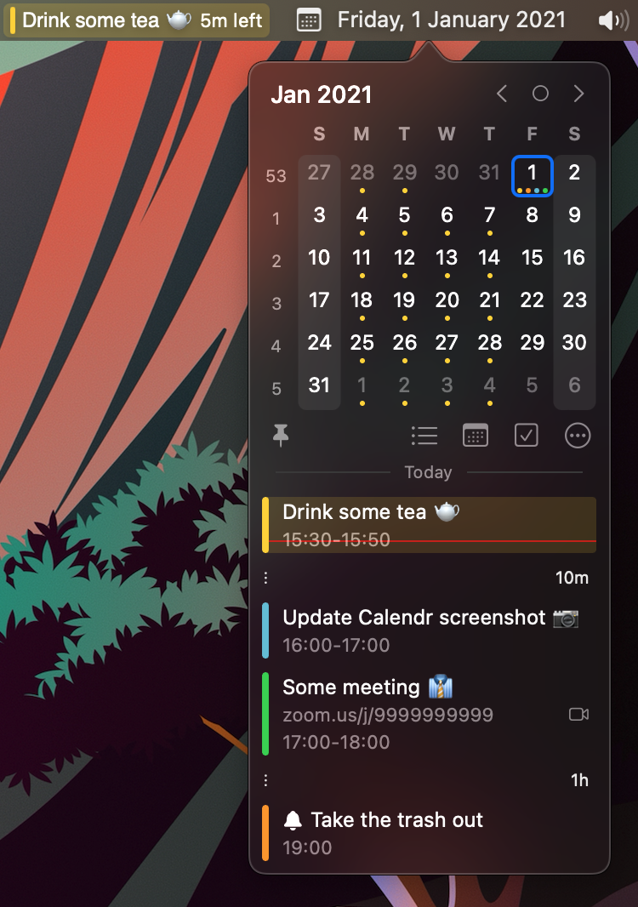

# Calendr

Menu bar calendar for macOS

<table>
<tr>
  <td>
    
    
    
  </td>
</tr>
</table>

Hey 🙋🏻‍♂️ if you like my app, please consider buying me a coffee to keep me motivated. 
(and maybe update the screenshot once in a while)

<table>
<tr>
  <td>
    <a href="https://star-history.com/#pakerwreah/Calendr&Date">
     <picture>
       <source width=679 media="(prefers-color-scheme: dark)" srcset="https://api.star-history.com/svg?repos=pakerwreah/Calendr&type=Date&theme=dark" />
       <source width=679 media="(prefers-color-scheme: light)" srcset="https://api.star-history.com/svg?repos=pakerwreah/Calendr&type=Date" />
       
     </picture>
    </a>
  </td>
</tr>
</table>

# Hidden features
## Open date with a URL scheme https://github.com/pakerwreah/Calendr/issues/314
date|encoded
--|--
`december`|`calendr://date/december` (defaults to current date and year)
`feb 10 2025`|`calendr://date/feb%2010%202025`
`2nd of September 2025`|`calendr://date/2nd%20of%20September%202025`

It has limited support to relative dates like: `today`, `yesterday`, `tomorrow` but will not work with `next week`, `last month`, etc.

That's how `NSDataDetector` works ¯\\_\(ツ\)\_/¯

## Regex to prevent showing the map/weather https://github.com/pakerwreah/Calendr/issues/377

Since **v1.19.0** the app has a built-in blacklist editor in settings that uses plain text.

To filter more complex locations, like office room codes, you can add a regex via terminal.

`defaults write br.paker.Calendr "show_map_blacklist_regex" -string "([A-Z0-9]+\-){5}.+"`

