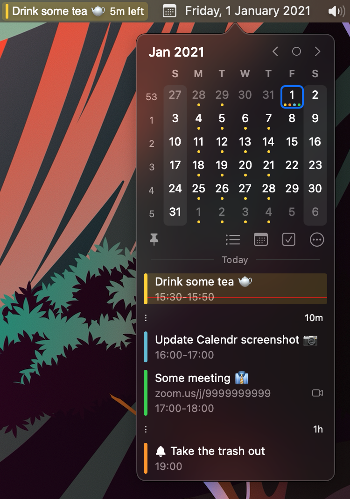
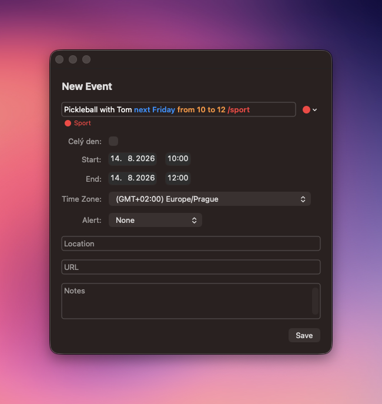

# Calendr

## Menu bar calendar for macOS

<table>
<tr>
  <td>
    
    
    
  </td>
</tr>
</table>

Hey 🙋🏻‍♂️ if you like my app, please consider buying me a coffee to keep me motivated. 
(and maybe update the screenshot once in a while)

## Natural-language event entry

Create events faster by typing the title together with optional date, time, duration, all-day, and calendar instructions. Calendr highlights recognized instructions while you type, immediately updates the event fields, and removes the instructions from the saved event title.

For example:

`Pickleball with Tom next Friday from 10 to 12 /sport`

- Dates: `today`, `tomorrow`, `yesterday`, `in a week`, `in 3 days`, `on Friday`, `at Friday`, `next Friday`, or `August 12`
- Times: `at 14`, `at 2pm`, `at noon`, `tomorrow morning`, `from 10 to 12`, or `at 22 until 1`
- Relative starts and durations: `in 2 hours`, `for 30 minutes`, `for 2 hours`, or `for 4 days`
- All-day events: `all day` or `full day`
- Calendars: add `/` followed by part of a calendar name, such as `/sport`, to fuzzy-match and select it

Natural-language instructions are currently English-only. The feature can be enabled or disabled in Settings and defaults to enabled when Calendr's preferred localization is English. Numeric dates follow the date order configured by the active locale, and the first word is always preserved as event title text.

<table>
<tr>
  <td>
    
  </td>
</tr>
</table>

## Hidden features 🔍

### Display multiple timezones in the menu bar
- Format
`HH:mm | HH:mm@GMT+2 'LT' | HH:mm@GMT-3 'BR'`
- Result
`15:00 | 17:00 LT | 12:00 BR`

### Open date with a URL scheme https://github.com/pakerwreah/Calendr/issues/314
date|encoded
--|--
`december`|`calendr://date/december` (defaults to current date and year)
`feb 10 2025`|`calendr://date/feb%2010%202025`
`2nd of September 2025`|`calendr://date/2nd%20of%20September%202025`

It has limited support to relative dates like: `today`, `yesterday`, `tomorrow` but will not work with `next week`, `last month`, etc.

That's how `NSDataDetector` works ¯\\_\(ツ\)\_/¯
